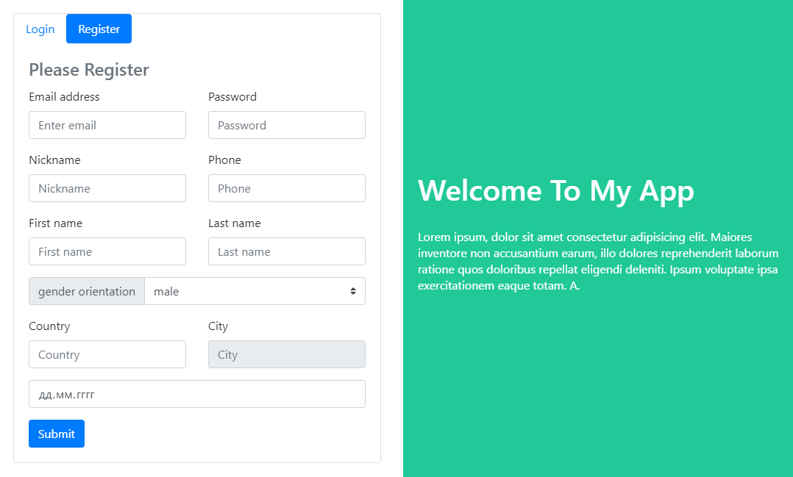

# login-project
## SPA проект

Проект реализации функционала логина.

***Цель***: Практика вёрстки на фреймворке **Bootstrap**. Изучение HTTP-запросов на сервер
по технологии JavaScript-библиотеки **Axios**. Изучение автокомплитов данных, валидации формы.

```
Native JavaScript
Bootstrap
Axios
Autocomplite countries and cities
```
## Посмотреть по ссылке: [LOGIN](https://volkovva.github.io/login-project/)


## Установка зависимостей
```
npm install
```

### Запуск сервера для разработки проекта
```
npm run dev
```

### Cобрать проект в продакшн
```
npm run build
```

